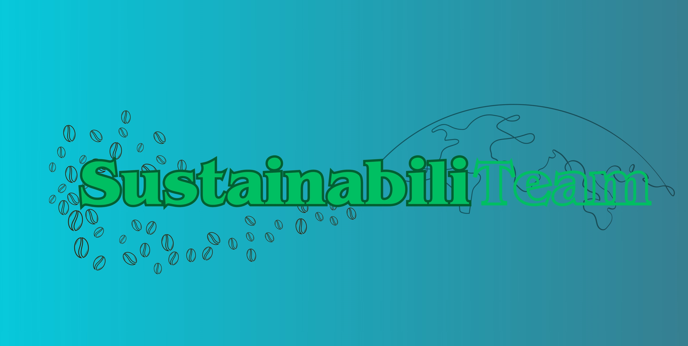
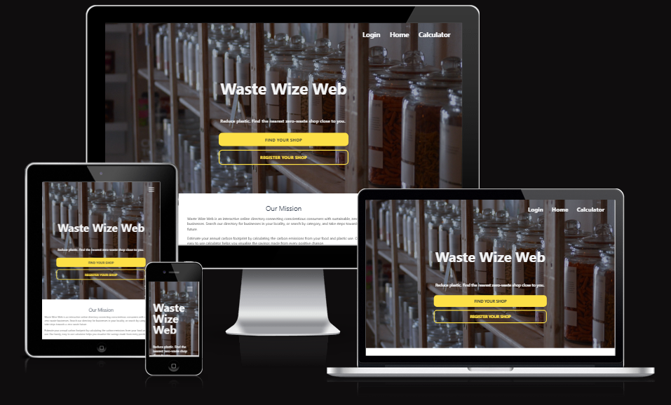
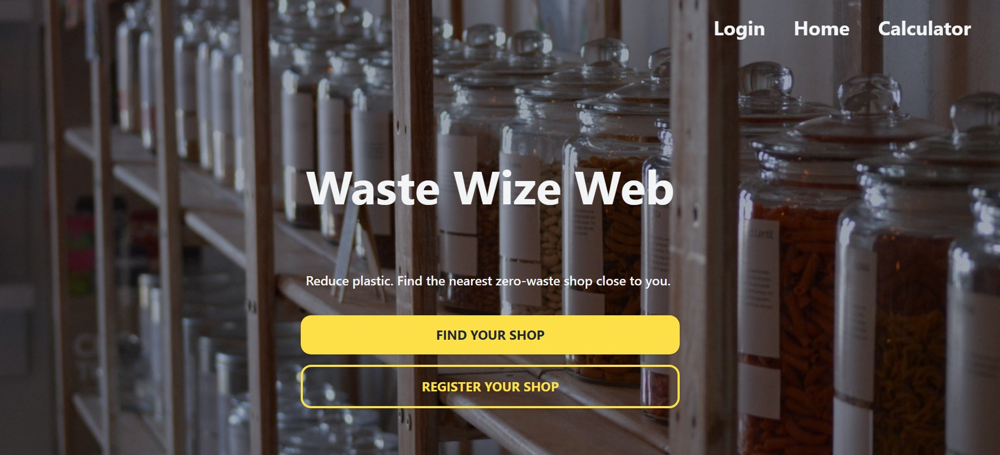
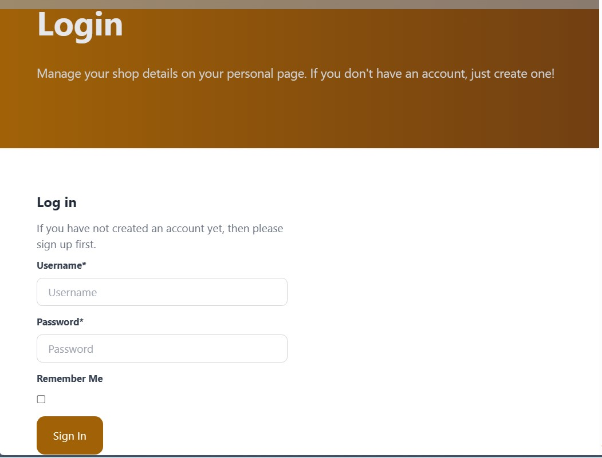
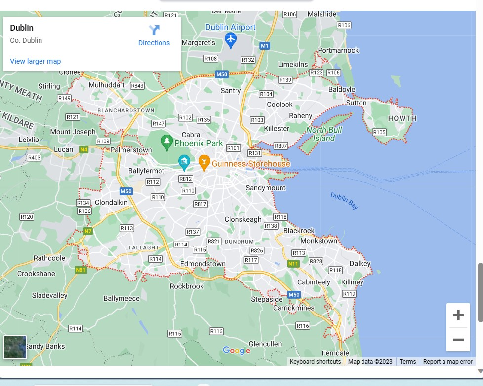
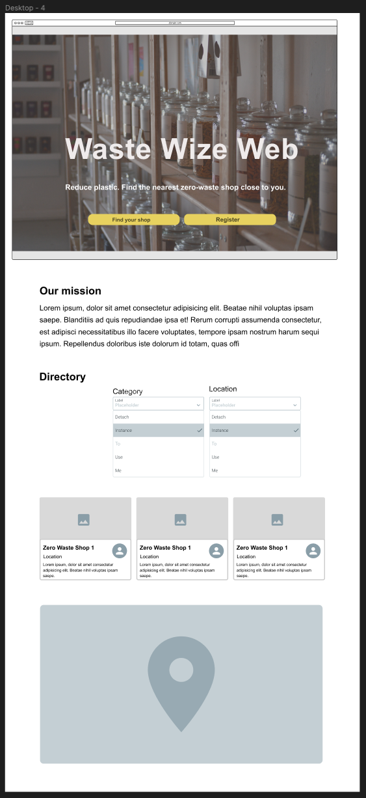

<h1 align="center">Tech for a Greener Tomorrow   🍃♻️🏞️🌱 Hackathon for Sustainable Solution 🌱🏞️♻️🍃

</h1>

 
## Intro
[Waste Wize Web (WWW)](https://wastewizeweb-b57952658889.herokuapp.com/) is an interactive online directory connecting conscientious consumers with sustainable, zero-waste businesses.
Search our directory for businesses in your locality, or search by category, and take steps towards a zero-waste future.
You can register to add a business to our directory.
Together, we can work towards a Greener Tomorrow.

## Goal
The goal section provides a concise summary of the main objective or purpose of the project or software described in this README. It addresses the following aspects:

- ➡️ Problem Statement

People are throwing away a considerable amount of packaging from food products. This site helps with reducing food waste for users.
  
- ➡️ Objective(s)

**WasteWizeWeb** site aims to inform users on how to reduce their food waste and the identification of locations near them that sell food products with little package waste.
  
- ➡️ Target Audience

Consumers who are conscious about their effect on the environment around them. Consumers who want to reduce their food waste.
  
- ➡️ Benefits
WasteWizeWeb provides a map-based directory of sustainable, zero-waste businesses to facilitate consumers to shop with zero waste.

## Features

### Landing Page

### Shop Directory

### calculator 

Where customers can up the Carbon calculator to estimate how much of a carbon footprint they produce. 

### Login/Register 
Where businesses and user can login and register for the website.

### Map
Google Map embedded to navigate user to nearest store.

## Future Features 
These are items what we would like to add to the website given more time and knowledge.
 - Google Map Api
 - More calculator categories such as plastics
 - Grouped and linked foods in the calculator

## Tech
In the tech section, we provide information about the technology stack, dependencies, and any technical details related to the project.

## Deployment 
This project was deployed using [Herku](https://www.heroku.com/) and can be accessed at [this address](https://wastewizeweb-b57952658889.herokuapp.com/).

**Languages:**
* HTML
* CSS
* JavaScript

**Frameworks:**
* Tailwind: CSS framework for developing responsive and mobile-first websites.
* Django: JavaScript framework to build a responsive website.
  
## Wireframes

Wireframes for the Waste Wize Web page 

## Credits
- External credits for embedded map on website - https://www.maps.ie/map-my-route/